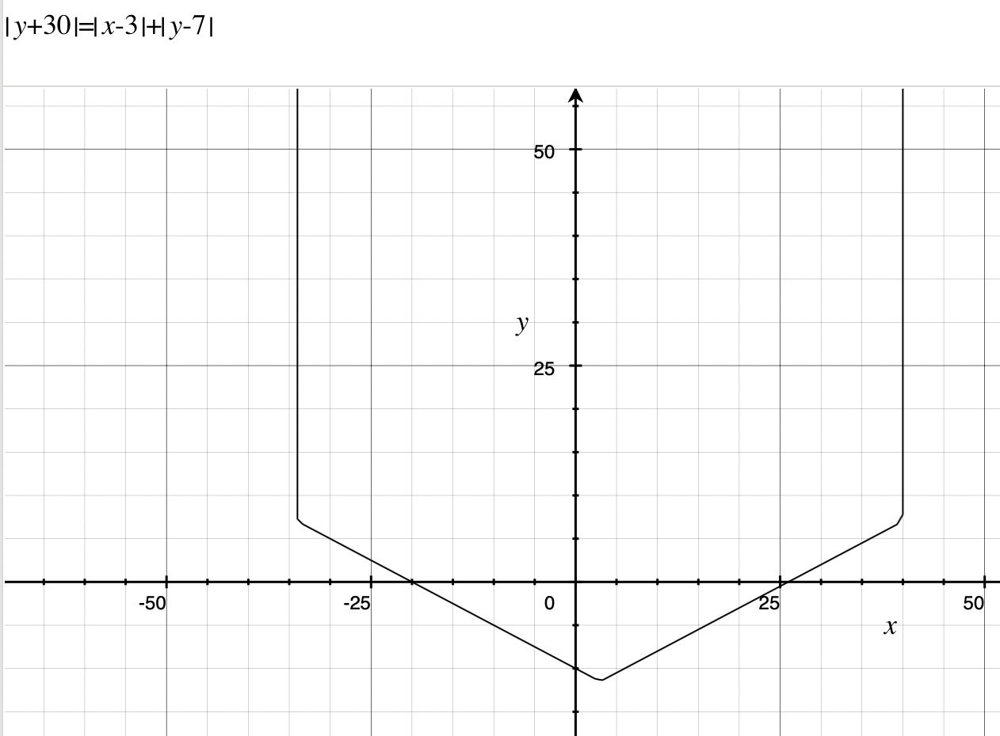

# Voronoi

I was looking at pictures of Voronoi diagrams on wikipedia and was inspired. I had previously heard of an application of sweep line (a type of algorithm I recently learned) which was used to generate voronoi diagrams. (Fortune' Algorithm) 

Sweep line essentially sweeps an imaginary line across the screen by sorting several points, or events of interest, and iterating over them. 
An additional line called the beach line was used to generate the actual lines for the points. The beach line is composed of many parabolas, with the points being the focus and the sweep line being the directrix. 

As, by definition, a point on the parabola is of equal distance to the directrix and focus, we can find where distances are equal by drawing multiple parabola with a shared directrix – the sweep line. This will mean that any intersection points are the boundaries of each point's area. 

However, for different types of distances such as Manhattan distance, a parabola does not work and instead it is a shape like this: . Still, the same mechanics hold and it is possible to create an (argubly cooler-looking) Voronoi diagram with the Manhattan distance. 

## Finding Circle Events

"Circle Events" are events where the directrix has moved down enough such that three arcs have intersected and are now fixed in position. They are called this because the point of intersection is, by definition, the point equidistant from the foci of each arc. Thus, it can be said that the arcs are on the circumference of a circle centered at the intersection point. 

## Credits

In creating this, I took instructions and information from [this blog](https://pvigier.github.io/2018/11/18/fortune-algorithm-details.html), which gave detailed instructions on his experience and [this blog](https://jacquesheunis.com/post/fortunes-algorithm/), which gave a nice, interactive overview. 